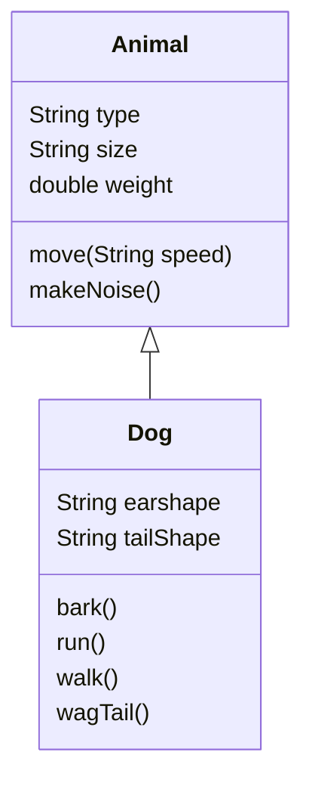

# 5. Object Oriented Programming (OOP)
Inheritance, Encapsulation, Polymorphism, Composition. 

OOP is a way to model real world objects, as software objects, which contain data (state) and code (behavior). Classes are blueprint for objects. 

If a field is static, there is only one copy in memory, and this value is associated with the class itself. 

If a field is not static, then it is called an instance field. 

A static method cannot be dependent on any one object's state, so it cannot reference any instance members. So, any method that operates on instance fields needs to be non-static. 

Classes can be organized into logical groupings (packages). You declare a package name in the class using the package statement. If you do not declare a package, this class implicitly belongs to the default package. 

A class is a top-level class if it is defined in teh source code file, and not enclosed in the code block of another class/type/method. A top-level class has only 2 valid access modifiers: 
- public: any other class in any package can access this class
- none: package access (the class is accessible only to classes in the same package)

An access modifier at the member level allows granular control over class members:
- public:  any other class in any package can access this class
- protected: allows classes in the same package, and any subclasses in other packages to access the member
- none: package access (the member is accessible only to classes in the same package)
- private: no other class can access this member

As a general rule, all your members in a class should be private. 

Encapsulation in OOP has 2 meanings:
1. the bundling of behavior and attributes on a single object
2. the practice of hiding fields and some methods, from public access. 

"Car.java":
```java
public class Car {

    private String make;
    private String model;
    private String color;
    private int doors;
    private boolean convertible;

    public void describeCar() {

        System.out.println(doors + "-Door " +
                color + " " +
                make + " " +
                model + " " +
                (convertible ? "Convertible" : ""));
    }
}
```

Fields on classes are assigned default values automatically by Java:
- boolean: false
- byte/short/int/long/char: 0
- double/float: 0.0
- other types: null

## Getters and Setters
Getter: a method on a class, that retrieves the value of a private field, and returns it. Can validate data, etc. 

Setter: a method on a class, that sets the value of a private field. Can render a private field. 

The purpose of these methods is to control/protect access to private fields. 

Getter and setter are part of car's public interface. Code -> Generate... in intelliJ can create new getter/setter methods for you. Note that for a boolean field, the getter should be is... . 

This provides encapsulation of the internals of the class, and supports maintenance of a public interface that doesn't have to change, even if the class might. 

`this` refers to the "current instance" that was created when the object was instantiated. 

An uninitialized variable such as `Car myCar;` causes a compile time error, but a variable with a null reference such as `Car myCar = null` can be used in code, without compiler errors, but will throw an exception at runtime. 

This is a ugly code that is painful to set data. 

Car.java
```java
public class Car {

    private String make = "Tesla";
    private String model = "Model X";
    private String color = "Gray";
    private int doors = 2;
    private boolean convertible = true;

    public String getMake() {
        return make;
    }

    public String getModel() {
        return model;
    }

    public String getColor() {
        return color;
    }

    public int getDoors() {
        return doors;
    }

    public boolean isConvertible() {
        return convertible;
    }

    public void setMake(String make) {

        if (make == null) make = "Unknown";
        String lowercaseMake = make.toLowerCase();
        switch (lowercaseMake) {
            case "holden", "porsche", "tesla" -> this.make = make;
            default -> {
                this.make = "Unsupported ";
            }
        }
    }

    public void setModel(String model) {
        this.model = model;
    }

    public void setColor(String color) {
        this.color = color;
    }

    public void setDoors(int doors) {
        this.doors = doors;
    }

    public void setConvertible(boolean convertible) {
        this.convertible = convertible;
    }

    public void describeCar() {

        System.out.println(doors + "-Door " +
                color + " " +
                make + " " +
                model + " " +
                (convertible ? "Convertible" : ""));
    }
}
```

Main.java
```java
public class Main {

    public static void main(String[] args) {

        Car car = new Car();
        car.setMake("Porsche");
        car.setModel("Carrera");
        car.setDoors(2);
        car.setConvertible(true);
        car.setColor("black");
        System.out.println("make = " + car.getMake());
        System.out.println("model = " + car.getModel());
        car.describeCar();

        Car targa = new Car();
        targa.setMake("Porsche");
        targa.setModel("Targa");
        targa.setDoors(2);
        targa.setConvertible(false);
        targa.setColor("red");

        targa.describeCar();
    }
}

```

## Constructors
Used for creating an object. It has the same name as the class, is like a method, and doesn't return any values, not even void. 

By default, if no explicit constructors are declared, a constructor is already created for you, implicitly by Java. When you use `new Account()` to create an Account object, it is calling the implicit constructor. 

If there is an explicit constructor, then the default is not implicitly declared. 

A class can have one or many constructors - constructor overloading. 

It is common practice to make the parameter names to be same as the instance field names, but it is not required. 

Constructor chaining: one constructor explicitly calls another overloaded constructor. Use `this(...); ` as the first statement from this constructor. 

The general rule is, it is always better, to assign the values directly to the field in the constructor, rather than calling the setter from a constructor. 

In IntelliJ, put the cursor in the place to be inserted, Code -> Generate... -> Constructor, and select the fields you want to get included -> OK. 

"Account.java":
```java
public class Account {

    private String number;
    private double balance;
    private String customerName;
    private String customerEmail;
    private String customerPhone;

    public Account() {
        this("56789", 2.50, "Default name",
                "Default address", "Default phone");
        System.out.println("Empty constructor called");
    }

    public Account(String number, double balance, String customerName, String email,
                   String phone) {
        System.out.println("Account constructor with parameters called");
        this.number = number;
        this.balance = balance;
        this.customerName = customerName;
        customerEmail = email;
        customerPhone = phone;
    }

    public Account(String customerName, String customerEmail, String customerPhone) {
        this("99999", 100.55, customerName, customerEmail, customerPhone);
//        this.customerName = customerName;
//        this.customerEmail = customerEmail;
//        this.customerPhone = customerPhone;
    }

    public void depositFunds(double depositAmount) {

        balance += depositAmount;
        System.out.println("Deposit of $" + depositAmount + " made. New balance is $" +
                balance);
    }

    public void withdrawFunds(double withdrawalAmount) {

        if (balance - withdrawalAmount < 0) {
            System.out.println("Insufficient Funds! You only have $" + balance +
                    " in your account.");
        } else {
            balance -= withdrawalAmount;
            System.out.println("Withdrawal of $" + withdrawalAmount +
                    " processed, Remaining balance = $" + balance);
        }
    }

    public String getNumber() {
        return number;
    }

    public void setNumber(String number) {
        this.number = number;
    }

    public double getBalance() {
        return balance;
    }

    public void setBalance(double balance) {
        this.balance = balance;
    }

    public String getCustomerName() {
        return customerName;
    }

    public void setCustomerName(String customerName) {
        this.customerName = customerName;
    }

    public String getCustomerEmail() {
        return customerEmail;
    }

    public void setCustomerEmail(String customerEmail) {
        this.customerEmail = customerEmail;
    }

    public String getCustomerPhone() {
        return customerPhone;
    }

    public void setCustomerPhone(String customerPhone) {
        this.customerPhone = customerPhone;
    }
}

```

"Main.java"
```java
public class Main {

    public static void main(String[] args) {

//        Account bobsAccount = new Account("12345", 500,
//                "Bob Brown", "myemail@bob.com",
//                "(087) 123-4567");

        Account bobsAccount = new Account();

        System.out.println(bobsAccount.getNumber());
        System.out.println(bobsAccount.getBalance());

//        bobsAccount.setNumber("12345");
//        bobsAccount.setBalance(1000.00);
//        bobsAccount.setCustomerName("Bob Brown");
//        bobsAccount.setCustomerEmail("myemail@bob.com");
//        bobsAccount.setCustomerPhone("(087) 123-4567");
        
        bobsAccount.withdrawFunds(100.0);
        bobsAccount.depositFunds(250);
        bobsAccount.withdrawFunds(50);

        bobsAccount.withdrawFunds(200);

        bobsAccount.depositFunds(100);
        bobsAccount.withdrawFunds(45.55);
        bobsAccount.withdrawFunds(54.46);

        bobsAccount.withdrawFunds(54.45);

        Account timsAccount = new Account("Tim",
                "tim@email.com", "12345");
        System.out.println("AccountNo: " + timsAccount.getNumber() +
                "; name " + timsAccount.getCustomerName());
    }
}

```

## Static vs Instance variables/methods
Each instance has its own copy of an instance variable. While all instances of a class share one static instance variable. 

Best practice: Use the class name, not a reference variable, to access a static instance variable. 

Static instance variables aren't used very often, but can be used for:
- Storing counters. 
- Generating unique ids. 
- Storing a constant value, such as PI. 
- Creating, controlling access to a shared resource (log file, db, IO stream, ...). 

If constructors set values of static variables, then these values will be same as when the last time the constructor was called. So you shouldn't use them this way. 

Static methods cannot access regular instance methods/variables directly. Used for operations that do not require any data from an instance of the class. This is why `main()` is static. 

You can use the class name to access a static method. 

Regular instance methods can access static methods/variables directly, without using `this` (but you can still use it of course, which helps with the clarity). 

Best practice: if a method is not using any regular instance methods/variables, should consider making it static. 

## POJO (Plain old Java object)
POJO (bean/JavaBean) only has instance fields. Only has getter and setters as methods. Used to house/pass data between functional classes. Many database use POJOs to read/write data to/from databases/files/streams. 

To create a toString() method for a class using IntelliJ: 
Code -> Generate... -> toString(), and select all the fields -> OK. 

Annotation, such as `@Override` is a type of metadata. More structured and detailed than comments. They can be used by the compiler to get info about the code. 

In Main.java:
```java
public class Main {

    public static void main(String[] args) {

        for (int i = 1; i <= 5; i++) {
            Student s = new Student("S92300" + i,
                    switch (i) {
                        case 1 -> "Mary";
                        case 2 -> "Carol";
                        case 3 -> "Tim";
                        case 4 -> "Harry";
                        case 5 -> "Lisa";
                        default -> "Anonymous";
                    },
                    "05/11/1985",
                    "Java Masterclass");
            System.out.println(s); // implicitly execute the toString() of the object
        }
    }
}
```

In Student.java:
```java
public class Student {

    private String id;
    private String name;
    private String dateOfBirth;
    private String classList;

    public Student(String id, String name, String dateOfBirth, String classList) {
        this.id = id;
        this.name = name;
        this.dateOfBirth = dateOfBirth;
        this.classList = classList;
    }

    @Override
    public String toString() {
        return "Student{" +
                "id='" + id + '\'' +
                ", name='" + name + '\'' +
                ", dateOfBirth='" + dateOfBirth + '\'' +
                ", classList='" + classList + '\'' +
                '}';
    }

    public String getId() {
        return id;
    }

    public void setId(String id) {
        this.id = id;
    }

    public String getName() {
        return name;
    }

    public void setName(String name) {
        this.name = name;
    }

    public String getDateOfBirth() {
        return dateOfBirth;
    }

    public void setDateOfBirth(String dateOfBirth) {
        this.dateOfBirth = dateOfBirth;
    }

    public String getClassList() {
        return classList;
    }

    public void setClassList(String classList) {
        this.classList = classList;
    }
}
```

If you were reading data from a database, or a csv file, you could create a whole set of POJOs, to collect all the data elements, in all your records. Once you have all this information in the POJOs, you can pass these objects to whatever code would process it, perhaps generate a mailing list, etc.

Even with code generation tool's help, this is still a lot of code. JDK 16 introduced a new type - the record, which does this for us. 

They are repetitive and follows certain rules. Once created this code is rarely modified. 

### The Record
Java's implicit POJO type (plain data carriers). A special class that contains data, that is not meant to be altered. Contains only the most basic methods: constructors and accessors/getters. As the developer, you don't have to write this code. 

In IntelliJ, in file explorer, right click the "src" folder -> New -> Java Class -> Record -> name it "LPAStudent". 

For a Record, Java generates implicitly:
- For each component in the record header, generates:
  - a private and final field (component field), with the same name/type as the component
  - a public accessor for it. e.g., id() for the field named as "id"
- A toString() method for for the record. 

"LPAStudent.java":
```java
public record LPAStudent(String id, String name, String dateOfBirth, String classList) { // parameter list (the record header)
}
```

"Main.java":
```java
public class Main {

    public static void main(String[] args) {

        for (int i = 1; i <= 5; i++) {
            LPAStudent s = new LPAStudent("S92300" + i,
                    switch (i) {
                        case 1 -> "Mary";
                        case 2 -> "Carol";
                        case 3 -> "Tim";
                        case 4 -> "Harry";
                        case 5 -> "Lisa";
                        default -> "Anonymous";
                    },
                    "05/11/1985",
                    "Java Masterclass");
            System.out.println(s);
        }

        Student pojoStudent = new Student("S923006", "Ann",
                "05/11/1985", "Java Masterclass");
        LPAStudent recordStudent = new LPAStudent("S923007", "Bill",
                "05/11/1985", "Java Masterclass");

        System.out.println(pojoStudent);
        System.out.println(recordStudent);

        pojoStudent.setClassList(pojoStudent.getClassList() + ", Java OCP Exam 829");
//        recordStudent.setClassList(recordStudent.classList() + ", Java OCP Exam 829"); // record do not have setters, so they can be immutable. 

        System.out.println(pojoStudent.getName() + " is taking " +
                pojoStudent.getClassList());
        System.out.println(recordStudent.name() + " is taking " +
                recordStudent.classList());
    }
}

```

Why immutable? Because you want to protect the data from unintended mutations. 

If you want to modify data on your class, you cannot use record - you should use POJO. But if you are reading records from a db or a file, and simply passing this data around, then the record class is helpful. 

## Inheritance
A form of code reuse. Organizes classes into a parent-child hierarchy, which lets the child inherit/reuse fields/methods from its parent. 

In the hierarchy, the most generic/base class is at the top. Every class below it is a subclass. A parent can have multiple children. A child can only have one direct parent, but it inherits from all the way up to the base class. 

A class diagram allows us to design the classes before building them. Such as:


"Main.java":
```java
public class Main {

    public static void main(String[] args) {

        Animal animal = new Animal("Generic Animal", "Huge", 400);
        doAnimalStuff(animal, "slow");

        Dog dog = new Dog();
        doAnimalStuff(dog, "fast");
    }

    public static void doAnimalStuff(Animal animal, String speed) {

        animal.makeNoise();
        animal.move(speed);
        System.out.println(animal);
        System.out.println("_ _ _ _");
    }
}
```

"Animal.java":
```java
public class Animal {

    private String type;
    private String size;
    private double weight;

    public Animal() {

    }

    public Animal(String type, String size, double weight) {
        // Code -> Generate... -> Constructor
        this.type = type;
        this.size = size;
        this.weight = weight;
    }

    @Override
    public String toString() {
        // Code -> Generate... -> toString()
        return "Animal{" +
                "type='" + type + '\'' +
                ", size='" + size + '\'' +
                ", weight=" + weight +
                '}';
    }

    public void move(String speed) {
        System.out.println(type + " moves " + speed);
    }

    public void makeNoise() {
        System.out.println(type + " makes some kind of noise");
    }
}
```

"Dog.java":
```java
public class Dog extends Animal { // "extends" declares its parent class

    public Dog() {
        super("Mutt", "Big", 50); // calls the parent's constructor
    }
}

```

If we use `super(...)`, it needs to be the first statement of the constructor. If you do not use `super()`, then Java makes it for you using super's default constructor. If your super class doesn't have a default constructor, then you must explicitly call `super(...)` in all of your constructors, and pass the right arguments. 

Next, we can make the Dog to be different from Animal, by declaring its specific fields/methods. 

"Dog.java":
```java
public class Dog extends Animal {

    private String earShape;
    private String tailShape;

    public Dog() {
        super("Mutt", "Big", 50);
    }
 
    public Dog(String type, double weight) {
        this(type, weight, "Perky", "Curled"); // calls the other Dog constructor (constructor chaining)
    }

    // Code -> Generate -> Constructor -> pick a parent constructor -> pick Dog's specific fields
    public Dog(String type, double weight, String earShape, String tailShape) {
        super(type, 
          weight <  15 ? "small" : (weight < 35 ? "medium" : "large"), // super needs to be the first statement, so has to do calc like this
          weight
        );
        this.earShape = earShape;
        this.tailShape = tailShape;
    }

    // Code -> Generate -> toString() -> Template: String concat and super.toString() -> Select two Dog attributes
    @Override
    public String toString() { // more specific than the Animal's toString(), so a Dog object use this toString()
        return "Dog{" +
                "earShape='" + earShape + '\'' +
                ", tailShape='" + tailShape + '\'' +
                "} " + super.toString(); // calls super class's methods
    }

    public void makeNoise() { // override the Animal's makeNoise()

    }

    // Code -> Override Methods -> pick the method to override
    @Override
    public void move(String speed) { 
        super.move(speed);
        System.out.println("Dogs walk, run and wag their tail");
    }
}
```

"Main.java":
```java
public class Main {

    public static void main(String[] args) {

        Animal animal = new Animal("Generic Animal", "Huge", 400);
        doAnimalStuff(animal, "slow");

        Dog dog = new Dog();
        doAnimalStuff(dog, "fast");

        Dog yorkie = new Dog("Yorkie", 15);
        doAnimalStuff(yorkie, "fast");
        Dog retriever = new Dog("Labrador Retriever", 65,
                "Floppy", "Swimmer");
        doAnimalStuff(retriever, "slow");
    }

    public static void doAnimalStuff(Animal animal, String speed) {

        animal.makeNoise();
        animal.move(speed);
        System.out.println(animal);
        System.out.println("_ _ _ _");
    }
}
```

Code re-use: All subclasses can execute methods declared in the parent class. So the code is not duplicated. 

Overriding a method: when you create a method on a subclass, that has the same signature as the one in a super class. In IntelliJ, a blue circle with a red arrow near the line number indicates this is an override. 

Next, we add dog specific methods to Dog. "Dog.java":
```java
public class Dog extends Animal {

    private String earShape;
    private String tailShape;

    public Dog() {
        super("Mutt", "Big", 50);
    }

    public Dog(String type, double weight) {
        this(type, weight, "Perky", "Curled");
    }

    public Dog(String type, double weight, String earShape, String tailShape) {
        super(type, weight <  15 ? "small" : (weight < 35 ? "medium" : "large"),
                weight);
        this.earShape = earShape;
        this.tailShape = tailShape;
    }

    @Override
    public String toString() {
        return "Dog{" +
                "earShape='" + earShape + '\'' +
                ", tailShape='" + tailShape + '\'' +
                "} " + super.toString();
    }

    public void makeNoise() { 
        if (type == "Wolf") { // inherited "type" from super class
            System.out.print("Ow Wooooo! ");
        }
        bark();
        System.out.println();
    }

    @Override
    public void move(String speed) {
        super.move(speed);
        if (speed == "slow") {
            walk();
            wagTail();
        } else {
            run();
            bark();
        }
        System.out.println();
    }

    private void bark() { // private, because only called internally
        System.out.print("Woof! ");
    }

    private void run() {
        System.out.print("Dog Running ");
    }

    private void walk() {
        System.out.print("Dog Walking ");
    }

    private void wagTail() {
        System.out.print("Tail Wagging ");
    }
}
```

Note that if a field in the super class is private, then no other classes, not even its subclasses, can access/use this field. So "Animal.java":
```java
public class Animal {

    protected String type; // so the subclasses and same package can access this field
    private String size;
    private double weight;

    public Animal() {

    }

    public Animal(String type, String size, double weight) {
        this.type = type;
        this.size = size;
        this.weight = weight;
    }

    @Override
    public String toString() {
        return "Animal{" +
                "type='" + type + '\'' +
                ", size='" + size + '\'' +
                ", weight=" + weight +
                '}';
    }

    public void move(String speed) {
        System.out.println(type + " moves " + speed);
    }

    public void makeNoise() {
        System.out.println(type + " makes some kind of noise");
    }
}

```

"Fish.java": 
```java
public class Fish extends Animal {

    private int gills;
    private int fins;

    public Fish(String type, double weight, int gills, int fins) {
        super(type, "small", weight);
        this.gills = gills;
        this.fins = fins;
    }

    private void moveMuscles() {
        System.out.print("muscles moving ");
    }

    private void moveBackFin() {
        System.out.print("backfin moving ");
    }

    @Override
    public void move(String speed) {
        super.move(speed);
        moveMuscles();
        if (speed == "fast") {
            moveBackFin();
        }
        System.out.println();
    }

    @Override
    public String toString() {
        return "Fish{" +
                "gills=" + gills +
                ", fins=" + fins +
                "} " + super.toString();
    }
}

```

"Main.java":
```java
public class Main {

    public static void main(String[] args) {

        Animal animal = new Animal("Generic Animal", "Huge", 400);
        doAnimalStuff(animal, "slow");

        Dog dog = new Dog();
        doAnimalStuff(dog, "fast");

        Dog yorkie = new Dog("Yorkie", 15);
        doAnimalStuff(yorkie, "fast");
        Dog retriever = new Dog("Labrador Retriever", 65,
                "Floppy", "Swimmer");
        doAnimalStuff(retriever, "slow");

        Dog wolf = new Dog("Wolf", 40);
        doAnimalStuff(wolf, "slow");

        Fish goldie = new Fish("Goldfish", 0.25, 2, 3);
        doAnimalStuff(goldie, "fast");
    }

    public static void doAnimalStuff(Animal animal, String speed) {
        animal.makeNoise();
        animal.move(speed);
        System.out.println(animal);
        System.out.println("_ _ _ _");
    }
}
```

Polymorphism. Example: Animal can take multiple forms, the base class Animal, or a Dog, or a Fish. It makes code simpler. The doAnimalStuff() method in main doesn't need to know what subclass type of the object it is. 

Every class in Java is implicitly a subclass of the java.lang.Object class, which is the root of the class hierarchy. It also means that all of your classes have functionalities built in them, that you can override, out of box. Such methods include clone(), equals(), toString(), etc. You can have `public class MyClass extends Object {...}`, but it is not necessary; if you select this `Object` in IntelliJ -> Go To -> Declaration or Usages -> and see the actual source code of this class. 

In IntelliJ, any class can have this: Code -> Generate -> Override Methods -> See a selection of methods that you can override. 

"Main.java":
```java
public class Main extends Object {

    public static void main(String[] args) {

        Student max = new Student("Max", 21);
        System.out.println(max); // implicitly calls the toString() of the object

        PrimarySchoolStudent jimmy = new PrimarySchoolStudent("Jimmy", 8,
                "Carole");
        System.out.println(jimmy);
    }
}

class Student { //  Note that only one class in a java file can be made public. 

    private String name;
    private int age;

    Student(String name, int age) {
        this.name = name;
        this.age = age;
    }

//    @Override
//    public String toString() {
//        return super.toString(); // will return class name and hex code
//    }

    @Override
    public String toString() { // use the "generate via wizard" in IntelliJ
        return name + " is " + age;
//        return "Student{" +
//                "name='" + name + '\'' +
//                ", age=" + age +
//                '}';
    }
}

class PrimarySchoolStudent extends Student {

    private String parentName;

    PrimarySchoolStudent(String name, int age, String parentName) {
        super(name, age);
        this.parentName = parentName;
    }

    @Override
    public String toString() {
        return parentName + "'s kid, " + super.toString();
    }
}

```

### `this` vs `super`
`super` is for access/call the parent class vars/methods. 

`this` is for access/call the current class vars/methods. 

When an field has the same name, `this` is required. 

You cannot use them for static elements in a class. 

`this(...)` and `super(...)` are for constructor calls. When you use `this(...)` or `super(...)`in a constructor, it has to be the first line of this constructor, so you cannot have both of them in one constructor. 

The best practice to create constructors is to have one constructor that takes the most variables, or use super(...), and have other simpler constructors to use it. Constructor chaining. 

### Method Overloading vs Overriding
Method overloading: 
- Have many methods in a class, or overloaded by subclasses, with the same name, but different parameters. 
- Can overload static/instance methods. 
- To the code calling an overloaded method, it looks like a single method can be called, with different sets of arguments. 
- Often referred to as "compile-time polymorphism". 

Method overriding:
- Defining a method in a child class, that already exists in the parent class, with the same signature (name and arguments). The return type can be same as, or a subclass of, the return type in the parent class, or covariant return type
- Knowns as "runtime polymorphism", or "dynamic method dispatch"
- Best practice: put `@override` immediately above the method definition. Though not required. If you do not properly override the method, it will get a compile error. (annotation)
- Cannot override static methods, constructors, private methods, final methods. 
- Cannot have more restrictive access privileges. 
- Cannot throw a new/broader checked exception. 

### The Java Text Block, and formatting options
A special format for multi-line String literals. Became part of the official language as of JDK 15. 

"Main.java":
```java
public class Main {

    public static void main(String[] args) {

        // this is ugly and hard to read
        String bulletIt = "Print a Bulleted List:\n" +
                "\t\u2022 First Point\n" + // u2022 is a bullet point character
                "\t\t\u2022 Sub Point";

        System.out.println(bulletIt);

        // this produces same result as above, but easier to read
        String textBlock = """
                
                Print a Bulleted List:
                    \u2022 First Point
                        \u2022 Sub Point""";

        System.out.println(textBlock);

        int age = 10;
        System.out.printf("Your age is %d%n", age); // %n is same with \n

        int yearOfBirth = 2023 - age;
        System.out.printf("Age = %d, Birth year = %d%n", age, yearOfBirth);
        System.out.printf("Your age is %.2f%n", (float) age);

        for (int i = 1; i <= 100000; i *= 10) {
            System.out.printf("Printing %6d %n", i); // set the width to 6
        }

        String formattedString = String.format("Your age is %d", age); // put this format into this string
        System.out.println(formattedString);

        formattedString = "Your age is %d".formatted(age); // included in jdk 15, works same as above
        System.out.println(formattedString);
    }
}
```

### More on String
"Main.java":
```java
public class Main {

    public static void main(String[] args) {
        // Hello World
        // 012345678910
        printInformation("Hello World");
        printInformation("");
        printInformation("\t   \n");

        String helloWorld = "Hello World";
        System.out.printf("index of r = %d %n", helloWorld.indexOf('r')); // 8
        System.out.printf("index of World = %d %n", helloWorld.indexOf("World")); // 6

        System.out.printf("index of l = %d %n", helloWorld.indexOf('l')); // 2
        System.out.printf("index of l = %d %n", helloWorld.lastIndexOf('l')); // 9

        System.out.printf("index of l = %d %n", helloWorld.indexOf('l',
                3)); // 3 // the location of 'l', starting from index 3, rightwards
        System.out.printf("index of l = %d %n", helloWorld.lastIndexOf('l',
                8)); //3 //  the location of 'l', starting from index 8, backwards

        String helloWorldLower = helloWorld.toLowerCase();
        if (helloWorld.equals(helloWorldLower)) {
            System.out.println("Values match exactly");
        }
        if (helloWorld.equalsIgnoreCase(helloWorldLower)) {
            System.out.println("Values match ignoring case");
        }

        if (helloWorld.startsWith("Hello")) {
            System.out.println("String starts with Hello");
        }
        if (helloWorld.endsWith("World")) {
            System.out.println("String ends with World");
        }
        if (helloWorld.contains("World")) {
            System.out.println("String contains World");
        }

        if (helloWorld.contentEquals("Hello World")) { // allows arg other than string, such as a StringBuilder
            System.out.println("Values match exactly");
        }
    }

    public static void printInformation(String string) {

        int length = string.length();
        System.out.printf("Length = %d %n", length);

        if (string.isEmpty()) {
            System.out.println("String is Empty");
            return;
        }

        if (string.isBlank()) { // length = 0, or only have white spaces, tabs, new lines... Available since JDK11
            System.out.println("String is Blank");
        }

        System.out.printf("First char = %c %n", string.charAt(0));
        System.out.printf("Last char = %c %n", string.charAt(length - 1));
    }
}

```

String manipulation methods. 
| method | description |
|---|---|
| indent | added in JDK 15. adds/removes spaces from the beginning of lines in multi-line text  |
| strip/stripLeading/stripTrailing/trim | strip() supports a larger set of white space characters. stripLeading(), stripTrailing() was added in JDK 11 |
| toLowerCase/toUpperCase | returns a new str in lower/upper case |
| concat | similar to + operator for strs |
| join | concatenates many strings with the delimiter specified |
| repeat | return the str repeated by num of times |
| replace/replaceAll/replaceFirst | works as named |
| substring/subSequence | return the substring as of specified range |

"StringMethods.java":
```java
public class StringMethods {

    public static void main(String[] args) {

        String birthDate = "01/02/2010";
        int startingIdxOfYear = birthDate.indexOf("2010"); // 6
        System.out.println("startingIdxOfYear = " + startingIdxOfYear);
        System.out.println("Birth year = " + birthDate.substring(startingIdxOfYear)); 
        System.out.println("Month = " + birthDate.substring(3, 5)); // 01

        String newDate = String.join("/", "07", "31", "2023");
        System.out.println("newDate = " + newDate); // 07/31/2023
        // the tedious alternative of join:
        newDate = "07";
        newDate = newDate.concat("/");
        newDate = newDate.concat("31");
        newDate = newDate.concat("/");
        newDate = newDate.concat("2023");
        System.out.println("newDate = " + newDate);
        // another alternative of join:
        newDate = "07" + "/" + "31" + "/" + "2023";
        System.out.println("newDate = " + newDate);
        // another alternative of join, using method chaining
        newDate = "07".concat("/").concat("31").concat("/").concat("2023");
        System.out.println("newDate = " + newDate);

        // replace all occurrences of this char
        System.out.println(newDate.replace('/', '-')); 
        // replace all occurrences of this str
        System.out.println(newDate.replace("2", "00")); 
        // replace first occurrence of the regex str
        System.out.println(newDate.replaceFirst("/", "-")); 
        // replace all occurrences of the regex str
        System.out.println(newDate.replaceAll("/", "---"));

        System.out.println("ABC\n".repeat(3));
        System.out.println("-".repeat(20));

        System.out.println("ABC\n".repeat(3).indent(8)); // every line now has 8 spaces at the beginning
        System.out.println("-".repeat(20));

        System.out.println("    ABC\n".repeat(3).indent(-2)); // the indent now is 2, instead of 4
        System.out.println("-".repeat(20));
    }
}

```

StringBuilder. String is immutable, so Java provides mutable class StringBuilder. 

"Main.java":
```java
public class Main {

    public static void main(String[] args) {

        String helloWorld = "Hello" + " World";
        helloWorld.concat(" and Goodbye"); // the returned str was never assigned to a var
        printInformation(helloWorld);

        StringBuilder helloWorldBuilder = new StringBuilder("Hello" + " World");
        helloWorldBuilder.append(" and Goodbye"); // no need to assign the result
        printInformation(helloWorldBuilder);

        StringBuilder emptyStart = new StringBuilder();
        emptyStart.append("a".repeat(57));

        StringBuilder emptyStart32 = new StringBuilder(32); // give a starting capacity
        emptyStart32.append("a".repeat(17));

        printInformation(emptyStart);
        printInformation(emptyStart32);

        StringBuilder builderPlus = new StringBuilder("Hello" + " World");
        builderPlus.append(" and Goodbye");

        builderPlus.deleteCharAt(16).insert(16, 'g');
        System.out.println(builderPlus); // Hello World and goodbye

        builderPlus.replace(16, 17, "G");
        System.out.println(builderPlus); // Hello World and Goodbye

        builderPlus.reverse().setLength(7); 
        System.out.println(builderPlus); // eybdooG
    }

    public static void printInformation(String string) {

        System.out.println("String = " + string);
        System.out.println("length = " + string.length());
    }

    public static void printInformation(StringBuilder builder) {

        System.out.println("StringBuilder = " + builder);
        System.out.println("length = " + builder.length());
        System.out.println("capacity = " + builder.capacity());
    }
}

```
By default, an empty StringBuilder starts with a capacity of 16, before it needs to request more memory. Every time a StringBuilder needs to increase capacity, the data stored in the original storage needs to get copied over to a larger storage area. If you plan to house a long text value in a StringBuilder object, start out with a larger capacity. 

| method | description |
|---|---|
| delete/deleteCharAt | delete a substr/char using specified indices  |
| insert | insert text at a specified loc |
| reverse | as named |
| setLength | can be used to truncate the sequence, or include null sequences to fill out the sequence to that length |

## Composition
Inheritance defines an "IS A" relationship; composition defines a "HAS A" relationship. Composition is basically creating objects within objects. 

Below example shows how a Personal Computer is made up of other parts. 

"Main.java"
```java
public class Main {
    public static void main(String[] args) {  
        ComputerCase theCase = new ComputerCase("2208", "Dell", "240");
        Monitor theMonitor = new Monitor("27inch Beast", "Acer", 27, "2540 x 1440");
        Motherboard theMotherboard = new Motherboard("BJ-200", "Asus", 4, 6, "v2.44");
        PersonalComputer thePC = new PersonalComputer("2208", "Dell", theCase, theMonitor, theMotherboard);

        // thePC.getMonitor().drawPixelAt(10, 10, "red");
        // thePC.getMotherboard().loadProgram("Windows OS");
        // thePC.getComputerCase().pressPowerButton();
        thePC.powerUp();
    }
}

```
"Product.java":
```java
public class Product {
    private String model;
    private String manufacturer;
    private int width;
    private int height;
    private int depth;

    public Product(String model, String manufacturer) {
        this.model = model;
        this.manufacturer = manufacturer;
    }
}

class Monitor extends Product { // one public class per file, so this cannot be public

    private int size;
    private String resolution;

    public Monitor(String model, String manufacturer) {
        super(model, manufacturer);
    }

    public Monitor(String model, String manufacturer, int size, String resolution) {
        super(model, manufacturer);
        this.size = size;
        this.resolution = resolution;
    }

    public void drawPixelAt(int x, int y, String color) {
        System.out.println(String.format(
                "Drawing pixel at %d,%d in color %s ", x, y, color));
    }
}

class Motherboard extends Product {

    private int ramSlots;
    private int cardSlots;
    private String bios;

    public Motherboard(String model, String manufacturer) {
        super(model, manufacturer);
    }

    public Motherboard(String model, String manufacturer, int ramSlots, int cardSlots,
                       String bios) {
        super(model, manufacturer);
        this.ramSlots = ramSlots;
        this.cardSlots = cardSlots;
        this.bios = bios;
    }

    public void loadProgram(String programName) {
        System.out.println("Program " + programName + " is now loading...");
    }
}

class ComputerCase extends Product {

    private String powerSupply;

    public ComputerCase(String model, String manufacturer) {
        super(model, manufacturer);
    }

    public ComputerCase(String model, String manufacturer, String powerSupply) {
        super(model, manufacturer);
        this.powerSupply = powerSupply;
    }

    public void pressPowerButton() {
        System.out.println("Power button pressed");
    }
}
```

"PersonalComputer.java":
```java
public class PersonalComputer extends Product {

    private ComputerCase computerCase;
    private Monitor monitor;
    private Motherboard motherboard;

    public PersonalComputer(String model, String manufacturer,
                            ComputerCase computerCase, Monitor monitor,
                            Motherboard motherboard) {
        super(model, manufacturer);
        this.computerCase = computerCase;
        this.monitor = monitor;
        this.motherboard = motherboard;
    }

    private void drawLogo() {
        monitor.drawPixelAt(1200, 50, "yellow");
    }

    public void powerUp() {
        computerCase.pressPowerButton();
        drawLogo();
    }

    // public ComputerCase getComputerCase() {
    //     return computerCase;
    // }

    // public Monitor getMonitor() {
    //     return monitor;
    // }

    // public Motherboard getMotherboard() {
    //     return motherboard;
    // }
}
```

As a rule, look at using composition before implementing inheritance. Because composition is more flexible - you can add/remove parts, and these changes are less likely to have a downstream effect. It provides functional reuse outside of the class hierarchy - so classes can share attributes/behavior, by having similar components, instead of inheriting from a parent. 

In our example, we have both inheritance and composition. If you need to include digital projects, and make it inherit the Product class, then it shouldn't have physical dimensions, so the digital products are inappropriately represented. Instead, we should create a Dimensions class/interface and let the products that have physical dimensions to implement/composite it. 

## Encapsulation
Hiding things, by making them private/inaccessible. Reasons for this:
- To hide unnecessary details
- To protect the integrity of data on an object
- To decouple the published interface (API) that is exposed by the class, from the internal details of the class. Gives flexibility, in case the class members need to be changed in the future. 

"Main.java":
```java
public class Main {
    public static void main(String[] args) {
       Player player = new Player();
       player.name = "Tim";
       player.health = 20;
       player.weapon = "Sword";

       int damage = 10;
       player.loseHealth(damage);
       System.out.println("Remaining health = " + player.healthRemaining());
       player.health = 200; // setting members outside of normal game play calls. 
       player.loseHealth(11);
       System.out.println("Remaining health = " + player.healthRemaining());
    }
}
```

"Player.java":
```java 
public class Player {
    public String name; // if later this var need to be renamed to fullName, then the code in the main function has to be changed accordingly
    public int health; // player health may not be set during use
    public String weapon;

    public void loseHealth(int damage) {

        health = health - damage;
        if (health <= 0) {
            System.out.println("Player knocked out of game");
        }
    }

    public int healthRemaining() {
        return health;
    }

    public void restoreHealth(int extraHealth) {

        health = health + extraHealth;
        if (health > 100) {
            System.out.println("Player restored to 100%");
            health = 100;
        }
    }
}

```

Allowing direct access to data on an object, can potentially bypass the checks etc, vs how you wanted the class to manage the data. 

Omitting a constructor may mean the calling code is responsible for setting up this data, on the new object. 

This is what encapsulation does, and why we do not want our code to be like above. The appropriate implementation should look like below. 

"Main.java":
```java
public class Main {
    public static void main(String[] args) {
        EnhancedPlayer tim = new EnhancedPlayer("Tim", 200, "Sword");
        System.out.println("Initial health is " + tim.healthRemaining());
    }
}
```

"EnhancedPlayer.java":
```java
public class EnhancedPlayer {
    private String fullName; // these are now private
    private int healthPercentage; 
    private String weapon; 

    public EnhancedPlayer(String fullName) {
        this(fullName, 100, "Sword");
    }

    public EnhancedPlayer(String fullName, int health, String weapon) {
        // now health var has guardrail
        this.fullName = fullName;
        if (health <= 0 ) {
            this.healthPercentage = 1;
        } else if (health > 100) {
            this.healthPercentage = 100;
        } else {
            this.healthPercentage = health;
        }
        this.weapon = weapon;
    }

    public void loseHealth(int damage) {
        healthPercentage = healthPercentage - damage;
        if (healthPercentage <= 0) {
            System.out.println("Player knocked out of game");
        }
    }

    public int healthRemaining() {
        return healthPercentage;
    }

    public void restoreHealth(int extraHealth) {
        healthPercentage = healthPercentage + extraHealth;
        if (healthPercentage > 100) {
            System.out.println("Player restored to 100%");
            healthPercentage = 100;
        }
    }
}
```

To rename an instance variable in a class, in IntelliJ, right click on the var name -> Refactor -> Rename... -> type the new name -> hit Enter -> choose to whether change it also in constructors -> OK. 

## Polymorphism
Let's us to write code to call a method, but at runtime, this method's behavior can be different for different objects. 

"Main.java":
```java
import java.util.Scanner; // from IntelliJ auto import, when create a Scanner

public class Main {
    public static void main(String[] args) {
        // Movie theMovie1 = new Movie("Star Wars");
        // theMovie1.watchMovie(); // Star Wars is a Movie film

        // Movie theMovie2 = new Adventure("Star Wars");
        // theMovie2.watchMovie(); // Star Wars is a Adventure film (followed by 3 more lines)

        Scanner s = new Scanner(System.in);
        while (true) {
            System.out.print("Enter Type (A for Adventure, C for Comedy, " +
                    "S for Science Fiction, or Q to quit): ");
            String type = s.nextLine();
            if ("Qq".contains(type)) {
                break;
            }
            System.out.print("Enter Movie Title: ");
            String title = s.nextLine();
            Movie movie = Movie.getMovie(type, title);
            movie.watchMovie();
        }
    }
}
```

"Movie.java":
```java
public class Movie {
    private String title;

    public Movie(String title) {
        this.title = title;
    }

    public void watchMovie() {
      // getClass() returns class type info at runtime
        String instanceType = this.getClass().getSimpleName();
        System.out.println(title + " is a " + instanceType + " film");
    }

    // This is a factory method design pattern
    public static Movie getMovie(String type, String title) {
        return switch (type.toUpperCase().charAt(0)) {
            case 'A' -> new Adventure(title);
            case 'C' -> new Comedy(title);
            case 'S' -> new ScienceFiction(title);
            default -> new Movie(title);
        };
    }
}

class Adventure extends Movie {

    public Adventure(String title) {
        super(title);
    }

    @Override // created using IntelliJ code generation tool
    public void watchMovie() {
        super.watchMovie();
        System.out.printf(".. %s%n".repeat(3),
                "Pleasant Scene",
                "Scary Music",
                "Something Bad Happens");
    }
}

class Comedy extends Movie { // created by clapsing and copying prv class

    public Comedy(String title) {
        super(title);
    }

    @Override
    public void watchMovie() {
        super.watchMovie();
        System.out.printf(".. %s%n".repeat(3),
                "Something funny happens",
                "Something even funnier happens",
                "Happy Ending");
    }
}

class ScienceFiction extends Movie {

    public ScienceFiction(String title) {
        super(title);
    }

    @Override
    public void watchMovie() {
        super.watchMovie();
        System.out.printf(".. %s%n".repeat(3),
                "Bad Aliens do Bad Stuff",
                "Space Guys Chase Aliens",
                "Planet Blows Up");
    }
}
```

With polymorphism, if in the future, we need ao add a new movie type, then the calling code doesn't need to change at all. It doesn't need to know which exact class the returned object is. 

Polymorphism enables us to write generic code, based on the base class, or a parent class. 

## Casting with classes, using Object and var references
"NextMain.java":
```java
public class NextMain {
    public static void main(String[] args) {
        Movie movie = Movie.getMovie("A", "Jaws");
        movie.watchMovie();

        // Adventure jaws = Movie.getMovie("A", "Jaws") will give compile error
        // because without running the code, compiler cannot know 
        // which exact class it will return
        // could be a Comedy movie. 
        Adventure jaws = (Adventure) Movie.getMovie("A", "Jaws");
        // above casting will make the compiler shut up
        // but if at runtime, it returned a Comedy,
        // it will throw an exception. 
        jaws.watchMovie();

        // you can assign any object to a Object ref, then it loses its Comedy-ness
        Object comedy = Movie.getMovie("C", "Airplane");
        // casting it back to Comedy will recover its Comedy-ness
        Comedy comedyMovie = (Comedy) comedy;
        comedyMovie.watchComedy(); // works if Comedy class has this method

        var airplane = Movie.getMovie("C", "Airplane");
        airplane.watchMovie();

        var plane = new Comedy("Airplane");
        plane.watchComedy();
    }
}

```

`var` is a contextual keyword in Java, introduced in Java 10, that let your code use Local Variable Type Inference. Using this, Java can figure out the compile-time type for us, from the signature of the method. It helps with the readability of the code, and to reduce boilerplate code. 

The compile time type is the declared type (as variable ref, return type, ...). 

## Testing the runtime type using the instanceOf operator


## Organizing Java Classes, Packages and Import Statements


